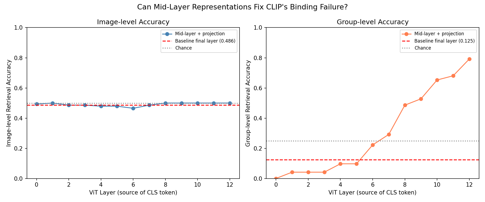
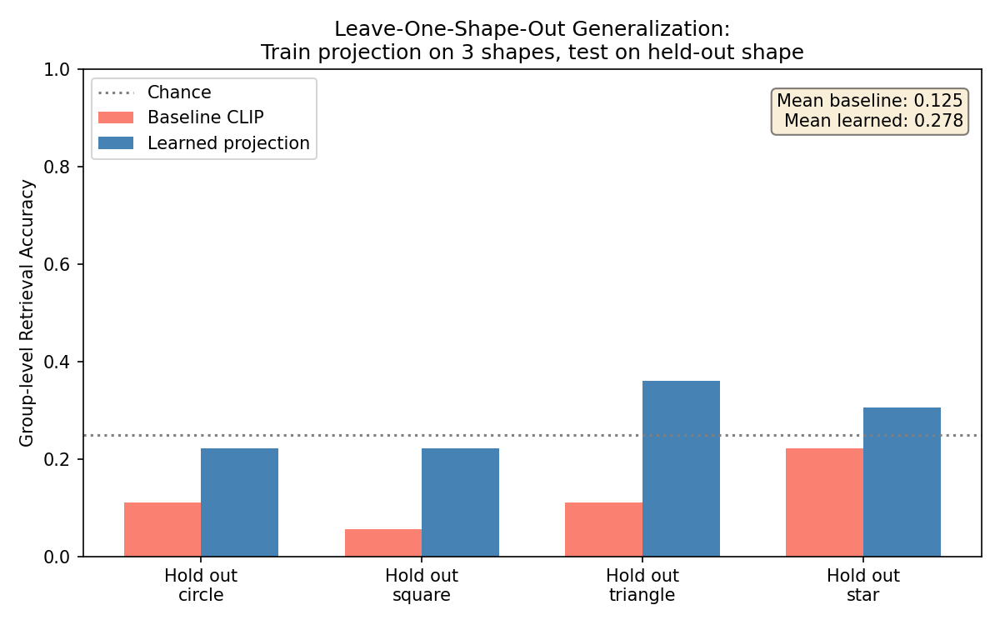
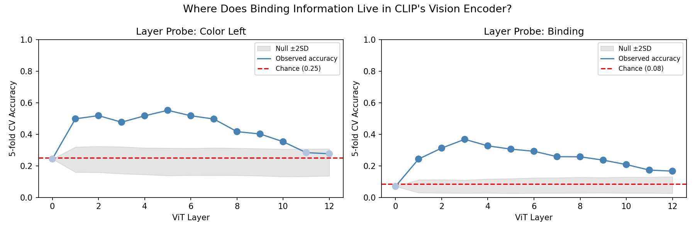
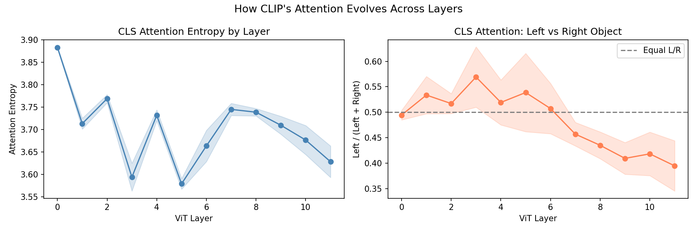

# CLIP Binding Probe

**Does CLIP's vision encoder encode attribute binding — and if so, where does it fail?**

CLIP can't tell *"a red cube and a blue sphere"* apart from *"a blue cube and a red sphere."* Prior work (Winoground, ARO) shows this failure behaviorally. This project probes **where inside the vision encoder** binding information appears and disappears — and whether it can be recovered with a post-hoc fix.

## Key Findings

**1. Binding info exists but gets erased.** Layers 3–5 of CLIP's ViT contain statistically significant binding information (permutation test, p < 0.001). Later layers progressively erase it. By the final layer, binding accuracy collapses to chance.

**2. A learned projection recovers binding within-distribution.** Replacing CLIP's default projection with a Ridge regression improves group-level retrieval from 12.5% to 79.2% on training shapes (cross-validated).

**3. But the fix doesn't generalize.** In leave-one-shape-out evaluation, both linear (27.8%) and nonlinear MLP (26.4%) projections barely beat chance (25%). Binding information in CLIP is entangled with object identity — it doesn't transfer to unseen shapes.

**Bottom line:** CLIP's binding failure can't be fixed with a post-hoc projection head. The binding signal is real but shape-specific, meaning a true fix requires retraining or fine-tuning the model.




## Results

### Retrieval test — does CLIP pick the right caption?

| Metric | Accuracy | Chance |
|--------|----------|--------|
| Image-level | 0.549 | 0.50 |
| Group-level | 0.125 | 0.25 |

Group-level below chance means CLIP tends to match *both* images in a foil pair to the same caption — it sees them as interchangeable.

### Binding probe — is binding info in the final embedding?

| Task | Accuracy | Chance |
|------|----------|--------|
| Color-shape binding | 0.166 | 0.083 |
| Color left | 0.276 | 0.250 |
| Color right | 0.284 | 0.250 |

The final embedding carries almost no usable binding information.

### Layer probe — where does binding info live and die?



Binding information peaks at layers 3–5, is statistically significant through layer 10 (permutation test, 1000 iterations, p < 0.001), and falls back to chance by layer 12.

### Can we fix it with a learned projection?

| Method | Group accuracy (within-dist) | Group accuracy (held-out shape) |
|--------|-----------------------------|---------------------------------|
| Baseline CLIP | 0.125 | 0.125 |
| Ridge regression | 0.792 | 0.278 |
| MLP (768→256→512) | — | 0.264 |
| Chance | 0.250 | 0.250 |

The learned projection works within-distribution but fails to generalize — binding info is entangled with object identity.

### Attention analysis



Attention entropy decreases across layers (attention narrows), and left/right balance shifts asymmetrically in later layers — consistent with binding info being lost as the model collapses to a global representation.

## Pipeline

```
Synthetic stimuli (shape pairs + foils)
        ↓
CLIP ViT-B/32 embeddings (final layer + all intermediate layers)
        ↓
Retrieval test          — does CLIP rank correct text above foil?
Binding probe           — linear probe on final vision embeddings
Layer probe             — linear probe at each ViT layer (with permutation test)
Attention maps          — CLS attention heatmaps across layers
Mid-layer retrieval     — learned projection from each layer
Generalization tests    — leave-one-shape-out and novel shape evaluation
```

## Setup

```bash
pip install -r requirements.txt
```

## Run order

```bash
python stimuli/generate_stimuli.py            # synthetic shape pairs
python embeddings/extract_clip.py             # CLIP vision + text embeddings
python analysis/retrieval_test.py             # behavioral retrieval accuracy
python analysis/binding_probe.py              # linear probe on final embeddings
python analysis/layer_probe.py                # layer-wise binding probe (~20 min)
python analysis/attention_maps.py             # attention heatmaps
python analysis/midlayer_retrieval.py         # learned projection per layer
python analysis/leave_shape_out_retrieval.py  # held-out shape generalization
python analysis/nonlinear_retrieval.py        # MLP projection generalization
```

## Stimuli

Synthetic images of shape pairs (circle, square, triangle, star) in four colors (red, blue, green, yellow). For each pair, a foil image swaps the color-shape bindings while keeping object positions fixed.

- 16 singleton images (one shape, one color)
- 144 pair images (72 foil pairs)
- 24 held-out images (pentagon, diamond — novel shapes)

## Related work

- Thrush et al. (2022). [Winoground: Probing Vision and Language Models for Visio-Linguistic Compositionality.](https://arxiv.org/abs/2204.03162)
- Yuksekgonul et al. (2022). [When and Why Vision-Language Models Behave like Bag-of-Words Models, and What to Do About It.](https://arxiv.org/abs/2210.01936)
